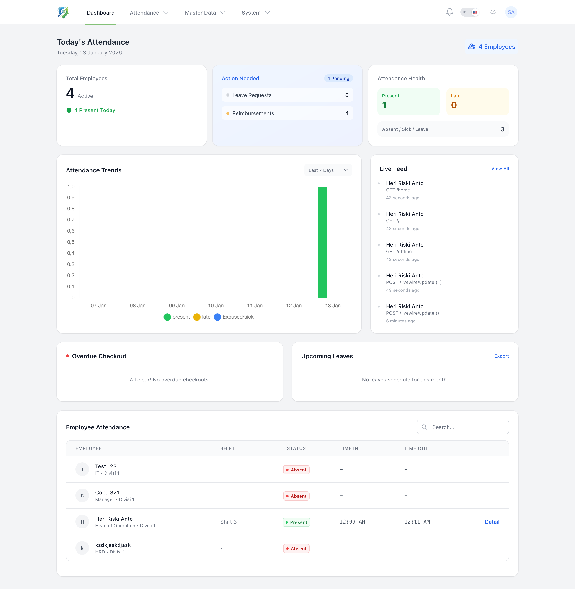
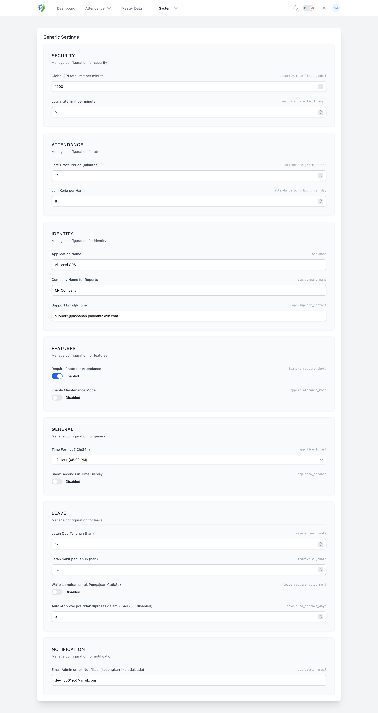
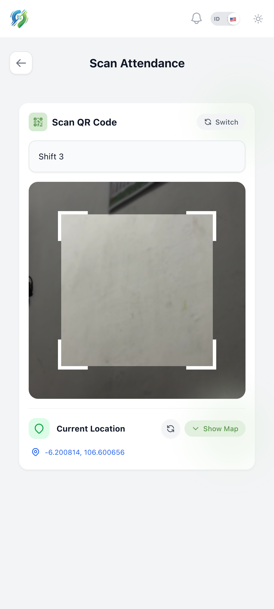

<div align="center">


# PasPapan - Enterprise Attendance System

**Advanced GPS Geofencing, Biometric Verification & Payroll Solution**

[](https://laravel.com)
[](https://livewire.laravel.com)
[](https://tailwindcss.com)
[](https://capacitorjs.com)

</div>

---

## Overview

**PasPapan** is a comprehensive Human Resource Information System (HRIS) designed for modern hybrid workforces. It bridges the gap between secure physical attendance and remote flexibility using advanced location validation, native mobile capabilities, and a robust web administration panel.

---

## 🔄 System Workflow

1.  **Check-In Request**: User initiates attendance via Mobile App / PWA.
2.  **Validation Layer**:
    *   **GPS**: Verifies user is within permitted office radius (Geofencing).
    *   **Anti-Fake GPS**: Analyzes signal accuracy and variance.
    *   **Biometrics**: Scans Face ID matching user profile.
3.  **Data Processing**: Server records timestamp, coordinates, and photo evidence.
4.  **Administrative Action**: Supervisors receive notifications; data flows into Payroll calculation automatically.

---

## Key Features

### Attendance & Validation
- **GPS Geofencing**: High-precision location validation ensuring employees check-in only within designated office radii.
- **Fake GPS Detection**: Intelligent algorithms to analyze GPS accuracy, variance, and consistency to flag suspicious location spoofing attempts.
- **Face ID Verification**: AI-powered facial recognition to verify identity during attendance (Anti-Buddy Punching).
- **QR Code Scanning**: Dynamic QR code support for secure on-site verification.
- **Biometric Evidence**: Required selfie photo attachment with every attendance record.
- **Secure Photo Access**: Privacy-first file storage ensuring attendance photos are accessible only to authorized personnel, compatible with secure tunnels.

### HR & Management Modules
- **Payroll System**: Automated salary calculation including basic pay, overtime, and deductions with professional PDF payslip generation.
- **Overtime Management**: Digital workflow for overtime requests and supervisor approvals.
- **Leave & Reimbursement**: Integrated portals for leave applications and expense claims.
- **Shift Management**: Flexible shift scheduling with auto-detection logic.
- **Team Approvals**: Hierarchical approval system for managers and supervisors.

### Platform Capabilities
- **Enterprise Dashboard**: Real-time analytics, employee monitoring, and extensive reporting options (pro-rated logic, export to Excel).
- **Mobile Super App**: Native Android experience via Capacitor, supporting offline mode and background location services.
- **PWA Support**: Fully installable Progressive Web App (v1.9.3) for Desktop, iOS, and Android with verified manifest and service worker caching.
- **Multi-Language**: Native support for English and Indonesian (Bahasa Indonesia).

---

## 📸 Application Previews

<details>
<summary><b>Click to View Admin Dashboard</b></summary>
<br>

| Live Monitoring | Analytics |
| :---: | :---: |
|  |  |

</details>

<details>
<summary><b>Click to View Mobile App</b></summary>
<br>

| Home Screen | Attendance Scan |
| :---: | :---: |
|  |  |

</details>

---

## Technology Stack

### Backend
- **Framework**: Laravel 11.x (PHP 8.3)
- **Authentication**: Laravel Sanctum & Jetstream
- **Database**: MySQL / MariaDB

### Frontend
- **Interface**: Blade Templates with Tailwind CSS 3.4
- **Interactivity**: Livewire 3 (Full-stack reactivity) & Alpine.js
- **Components**: Tom Select (Searchable Dropdowns), Chart.js (Analytics)

### Mobile & PWA
- **Engine**: Capacitor 6 (Native Bridge)
- **PWA**: Custom Service Worker strategy (Network-First)
- **Features**: Native Camera & Geolocation Plugins

---

## Installation & Setup

### Prerequisites
- PHP 8.3 or higher
- Composer
- Node.js & NPM/Bun
- MySQL Server

### Development Setup

1. **Clone the Repository**
   ```bash
   git clone https://github.com/RiprLutuk/PasPapan.git
   cd PasPapan
   ```

2. **Install Dependencies**
   ```bash
   # Backend
   composer install

   # Frontend
   bun install  # or npm install
   ```

3. **Environment Configuration**
   ```bash
   cp .env.example .env
   php artisan key:generate
   ```
   *Configure your database credentials in the `.env` file.*

4. **Database Migration & Seeding**
   ```bash
   php artisan migrate --seed
   php artisan storage:link
   ```

5. **Run Application**
   ```bash
   # Terminal 1: Vite Dev Server
   bun run dev

   # Terminal 2: Laravel Server
   php artisan serve
   ```

### Mobile Build (Android)

```bash
bun run build
npx cap sync android
cd android
./gradlew assembleDebug
```
*Output APK located at: `android/app/build/outputs/apk/debug/app-debug.apk`*

---

## ❓ Troubleshooting

**Q: GPS not working / Camera blocked?**
> A: Ensure you are serving the app via **HTTPS** (e.g., using Cloudflare Tunnel, Ngrok, or Valet Secure). Browsers block sensitive permissions on HTTP (except localhost).

**Q: Maps not loading?**
> A: This app uses OpenStreetMap/Leaflet which is free. Ensure your device has internet access to load map tiles.

---

<div align="center">

### ☕ Traktir Developer Kopi


</div>

---

<div align="center">
  <p>Developed by <a href="https://github.com/RiprLutuk"><b>RiprLutuk</b></a></p>
</div>
