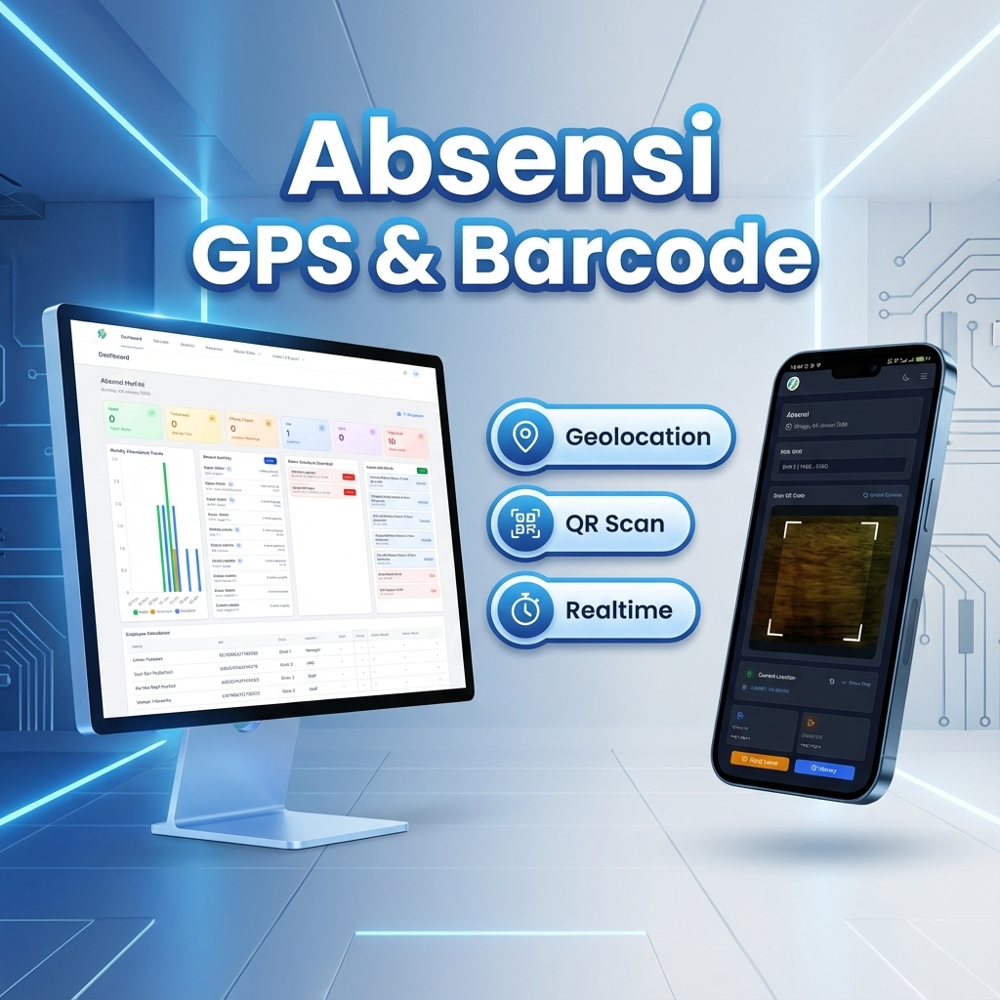
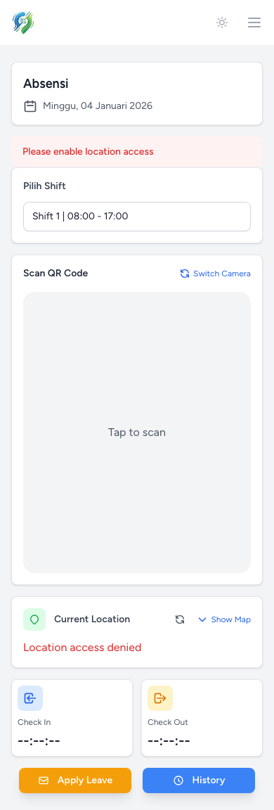
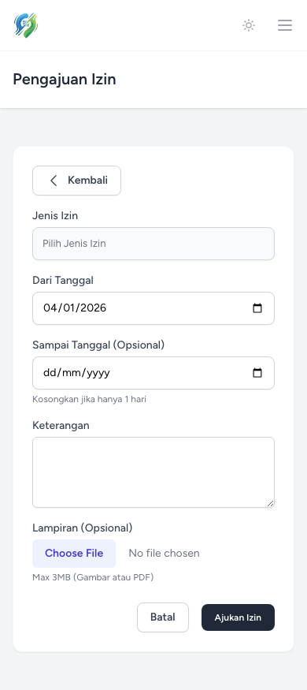
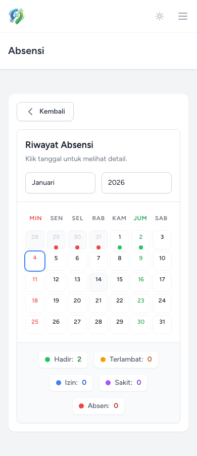
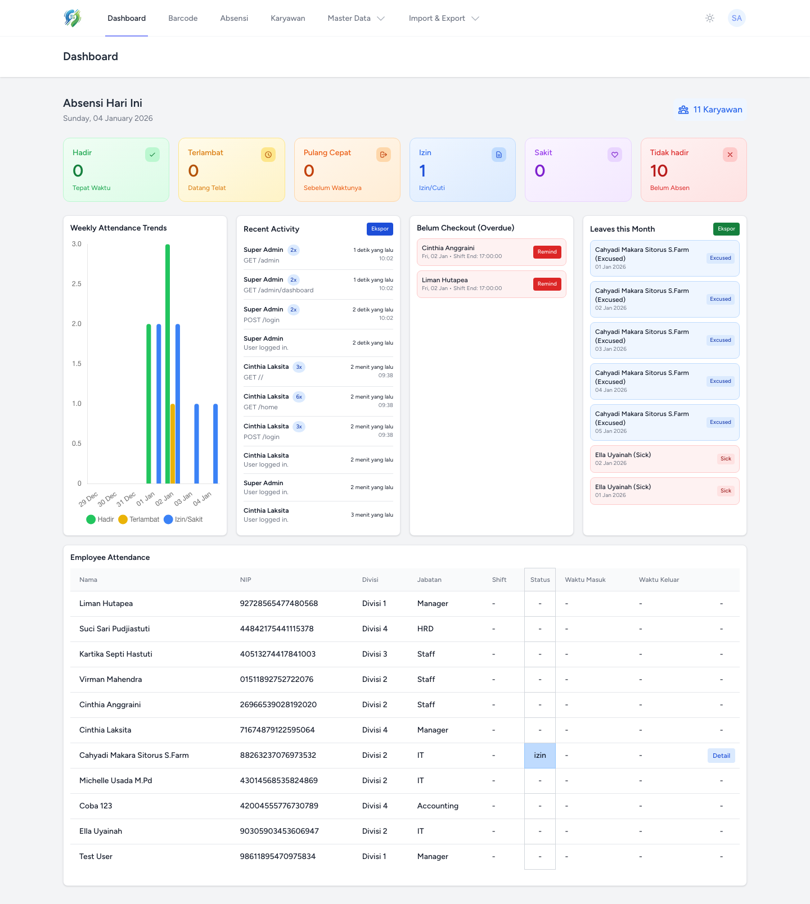
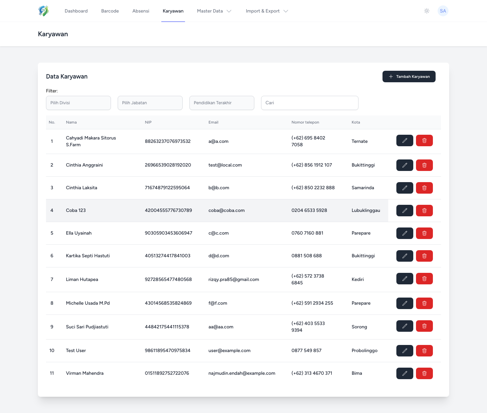
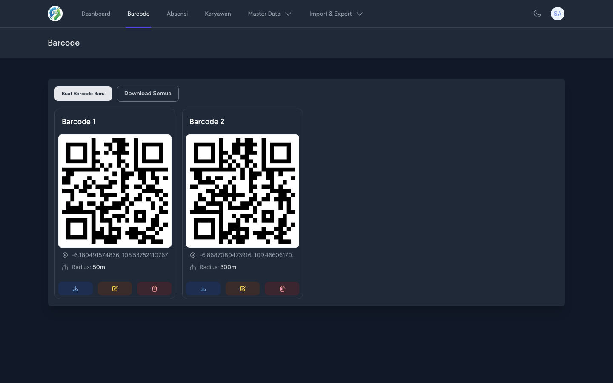
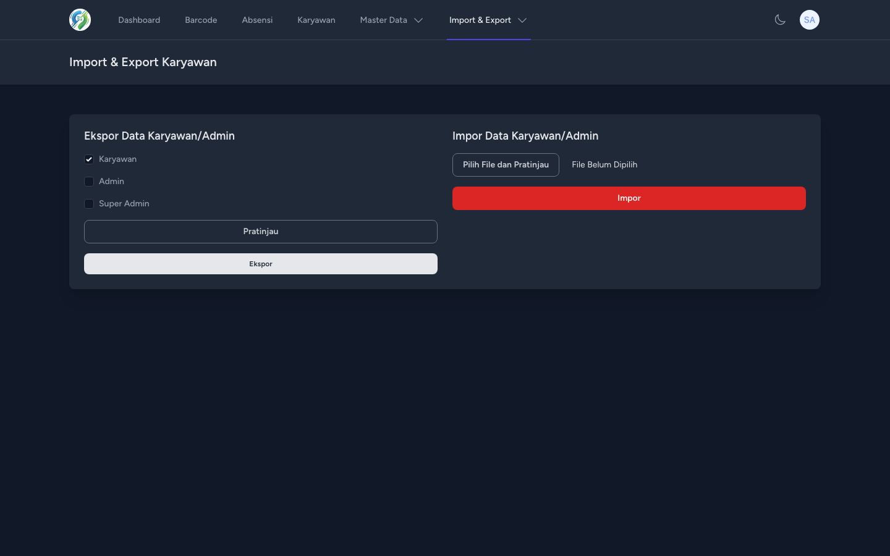
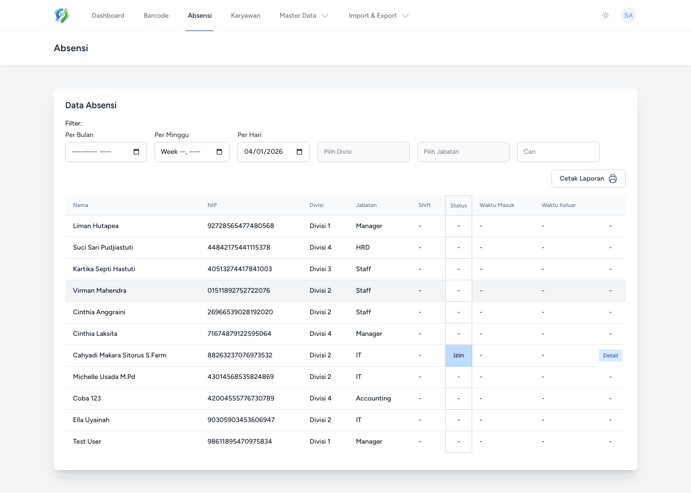

# Aplikasi Absensi GPS dan Barcode



Aplikasi absensi karyawan yang modern, responsif, dan kaya fitur menggunakan QR Code dan GPS untuk validasi lokasi. Dibangun dengan framework Laravel 11 dan teknologi web terkini.

> **Note**: Pengembangan fitur dan perbaikan bug pada aplikasi ini dilakukan dengan bantuan **AI (Artificial Intelligence)**.

> **Credit / Sumber Asli**: Inti dari aplikasi ini dikembangkan berdasarkan source code asli dari [ikhsan3adi/absensi-karyawan-gps-barcode](https://github.com/ikhsan3adi/absensi-karyawan-gps-barcode).

## Teknologi yang Digunakan

*   **Backend**: [Laravel 11](https://laravel.com/)
*   **Frontend**: [Laravel Jetstream](https://jetstream.laravel.com/), [Livewire](https://livewire.laravel.com/), [Tailwind CSS](https://tailwindcss.com/)
*   **Database**: MySQL/MariaDB
*   **QR Code**: [Endroid QR Code](https://github.com/endroid/qr-code) (Generation), [html5-qrcode](https://github.com/mebjas/html5-qrcode) (Scanning)
*   **Maps**: [Leaflet.js](https://leafletjs.com/) & [OpenStreetMap](https://www.openstreetmap.org/)
*   **UI Components**: [Tom Select](https://tom-select.js.org/) (Searchable Dropdowns), [Chart.js](https://www.chartjs.org/)

## Fitur Unggulan

### 📸 Scanner Canggih
*   **Camera Switching**: Dukungan kamera depan dan belakang.
*   **Mirroring**: Tampilan kamera yang natural (seperti cermin).
*   **Validasi Lokasi**: Memastikan karyawan berada dalam radius yang ditentukan saat scan.

### 🎨 UI/UX Modern & Responsif
*   **Tom Select**: Dropdown filter yang dapat dicari (Searchable) untuk Divisi, Jabatan, dll.
*   **Live Search**: Pencarian data (Karyawan, Log) secara real-time.
*   **Dark Mode**: Mendukung mode gelap sepenuhnya.
*   **Responsive Charts**: Grafik tren kehadiran yang menyesuaikan ukuran layar.
*   **Icon Actions**: Tombol aksi yang minimalis dan intuitif.

### 📊 Laporan & Ekspor Data
*   **Automatic Export Preview**: Pratinjau data ekspor (Excel) muncul otomatis saat memfilter (Tahun, Bulan, Divisi, dll).
*   **Dynamic Filters**: Filter data berdasarkan tahun, bulan, divisi, jabatan, dan pendidikan.
*   **Activity Logs**: Log aktivitas admin yang diringkas (aggregated) untuk menghindari spam data.

## Instalasi

### Prasyarat

*   [Composer](https://getcomposer.org)
*   [Bun](https://bun.sh) (Recommended) -> *Install: `curl -fsSL https://bun.sh/install | bash`*
    *   Atau gunakan: [Node.js & NPM](https://nodejs.org)
*   PHP 8.3 atau lebih tinggi
*   MySQL/MariaDB

### Langkah-langkah

1.  **Clone Repository**
    ```bash
    git clone https://github.com/RiprLutuk/absensi-gps-qr.git
    cd absensi-gps-qr
    ```

2.  **Setup Environment**
    Salin file `.env.example` ke `.env` dan sesuaikan konfigurasi database.
    ```bash
    cp .env.example .env
    ```

3.  **Install Dependencies**
    ```bash
    composer install
    bun install
    # atau: npm install
    ```

4.  **Generate Key**
    ```bash
    php artisan key:generate
    ```

5.  **Setup Database & Migrations**
    Pastikan database sudah dibuat di MySQL, lalu jalankan migrasi.
    ```bash
    php artisan migrate
    ```

6.  **Build Assets**
    ```bash
    bun run build
    # atau: npm run build
    ```

7.  **Jalankan Aplikasi**
    ```bash
    php artisan serve
    ```

### Seeder (Data Awal)

Untuk mengisi database dengan data awal atau data dummy untuk testing:

*   **Data Utama Saja (Admin, Divisi, dll)**:
    ```bash
    php artisan db:seed DatabaseSeeder
    ```
*   **Data Lengkap dengan Dummy (Karyawan, Absensi)**:
    ```bash
    php artisan db:seed FakeDataSeeder
    ```

### Implementasi Aplikasi Mobile (Android/APK)

Aplikasi ini menggunakan [Capacitor](https://capacitorjs.com/) untuk mengonversi web app menjadi aplikasi Android native.

#### Prasyarat
*   [Android Studio](https://developer.android.com/studio) (terbaru)
*   Android SDK Command-line Tools (install via Android Studio SDK Manager)

#### Langkah Build

1.  **Build Web Assets**
    Pastikan aset web terbaru sudah dibuild.
    ```bash
    bun run build
    # atau: npm run build
    ```

2.  **Sync ke Android**
    Salin aset web yang sudah dibuild ke direktori Android project.
    ```bash
    bunx cap sync android
    # atau: npx cap sync android
    ```

3.  **Buka Android Studio**
    Jalankan perintah ini untuk membuka project di Android Studio.
    ```bash
    bunx cap open android
    # atau: npx cap open android
    ```

4.  **Build APK**
    *   Di Android Studio, tunggu hingga proses indexing (Gradle sync) selesai.
    *   Klik menu **Build** > **Build Bundle(s) / APK(s)** > **Build APK(s)**.
    *   Tunggu proses selesai. Notifikasi akan muncul di pojok kanan bawah.
    *   Klik **locate** pada notifikasi untuk menemukan file `.apk` (biasanya di `android/app/build/outputs/apk/debug/app-debug.apk`).

#### Alternatif: Build Tanpa Membuka Android Studio (CLI Only)

Jika Anda tidak ingin membuka Android Studio, Anda bisa menggunakan perintah berikut via terminal:

```bash
bun run build
bunx cap sync android
cd android
./gradlew clean assembleDebug
adb uninstall com.absensi.test || true
adb install app/build/outputs/apk/debug/app-debug.apk
adb logcat | grep Capacitor
```

#### Catatan Penting (Debugging)
*   Jika menjalankan server lokal (`php artisan serve`), pastikan aplikasi mobile mengarah ke IP Address komputer Anda (misal `http://192.168.1.x:8000`), bukan `localhost` atau `127.0.0.1`.
*   Konfigurasi URL server dapat dicek di file `.env` atau `capacitor.config.ts` (jika ada konfigurasi `server.url` untuk live reload).

## Panduan Penggunaan

### 👨‍💼 Administrator

1.  **Dashboard**: Pantau kehadiran hari ini, tren mingguan, dan log aktivitas terbaru.
2.  **Master Data**: Kelola Divisi, Jabatan, Pendidikan, dan Shift.
3.  **Data Karyawan**: Tambah, edit, dan kelola akun karyawan. Password default karyawan adalah `password`.
4.  **Barcode**: Buat QR Code untuk setiap shift. Cetak atau tampilkan QR Code ini untuk discan karyawan.
5.  **Import/Export**:
    *   Masuk ke menu **Import/Export**.
    *   Pilih filter (Tahun, Bulan, Divisi, dll).
    *   **Pratinjau** akan muncul otomatis di bawah form.
    *   Klik **Export** untuk mengunduh file Excel.

### 👷 Karyawan

1.  **Scan Absensi**:
    *   Buka menu **Scan**.
    *   Izinkan akses kamera dan lokasi.
    *   Arahkan kamera ke QR Code shift.
    *   Sistem akan memvalidasi lokasi dan mencatat kehadiran (Masuk/Pulang).
2.  **Riwayat Absensi**: Lihat riwayat kehadiran pribadi.
3.  **Pengajuan Izin**: Ajukan izin atau sakit melalui form aplikasi.

## Screenshot

### User/Karyawan

| Scan Page | Scan Page (Mobile) |
|---|---|
|||

| Pengajuan Absensi | Riwayat Absensi Karyawan |
|---|---|
|||

### Admin & Superadmin

| Dashboard (Light) | Dashboard (Dark) |
|---|---|
|||

| Data Karyawan | Barcode Management |
|---|---|
|||

| Import/Export | Laporan Absensi |
|---|---|
|||

## Donasi ❤

[](https://saweria.co/riprlutuk)

Atau, beri star...⭐⭐⭐⭐


## Lisensi

Aplikasi ini dilisensikan di bawah [MIT License](LICENSE).
