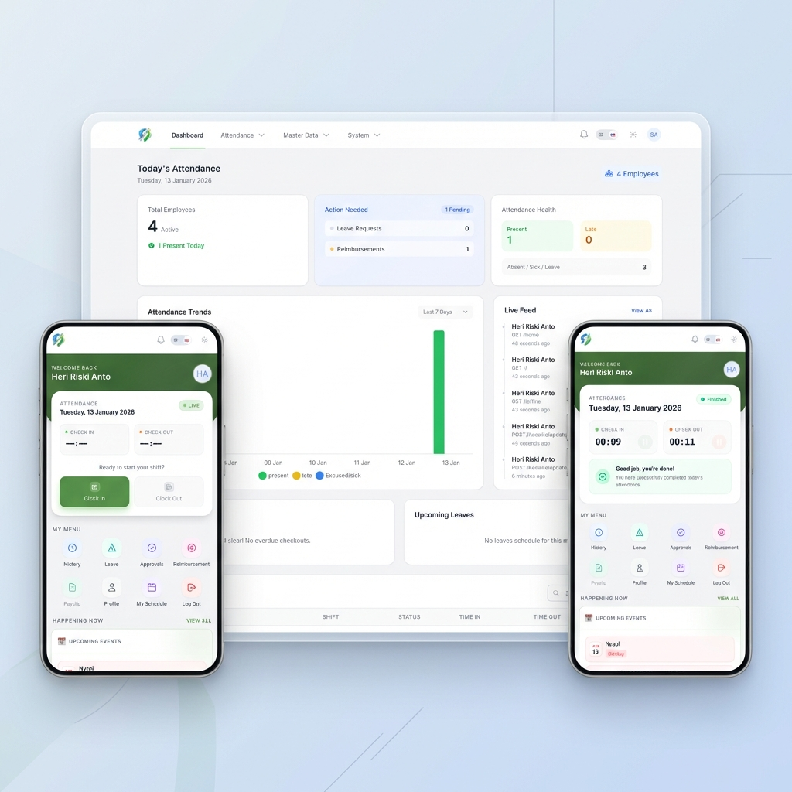

<div align="center">



# PasPapan - Enterprise Attendance System

**The Ultimate GPS Geofencing, Biometric Verification & Payroll Solution for Modern Enterprises.**

> Stop buddy punching, eliminate fake GPS attendance, and streamline your payroll in one powerful platform.

[](./README.id.md)
[](https://laravel.com)
[](https://livewire.laravel.com)
[](https://tailwindcss.com)
[](https://capacitorjs.com)

</div>

---

## Overview

**PasPapan** isn't just an attendance app; it's a complete **Workforce Management System**. Designed for the modern hybrid era, it bridges the gap between physical security and remote flexibility.

Whether your team is in the office, on the field, or working from home, PasPapan ensures every check-in is **verified, authentic, and actionable**.

---

## 📑 Table of Contents

- [System Workflow](#system-workflow)
- [Key Features](#key-features)
- [Application Previews](#application-previews)
- [Technology Stack](#technology-stack)
- [Installation (VPS / Server)](#installation)
- [Demo Credentials](#demo-credentials)
- [Troubleshooting](#troubleshooting)

---

## <a id="system-workflow"></a>🔄 System Workflow

1.  **Check-In Request**: User initiates attendance via Mobile App / PWA.
2.  **Validation Layer**:
    *   **GPS**: Verifies user is within permitted office radius (Geofencing).
    *   **Anti-Fake GPS**: Analyzes signal accuracy and variance.
    *   **Biometrics**: Scans Face ID matching user profile.
3.  **Data Processing**: Server records timestamp, coordinates, and photo evidence.
4.  **Administrative Action**: Supervisors receive notifications; data flows into Payroll calculation automatically.

---

## <a id="key-features"></a>Key Features

### 🛡️ Unbeatable Security & Validation
- **Smart Geofencing**: High-precision location locking ensures employees can *only* check in from designated zones.
- **Anti-Fake GPS Technology**: Advanced algorithms detect and block location spoofing, mock location apps, and signal manipulation.
- **Face ID Verification**: AI-powered facial recognition eliminates "buddy punching" forever.
- **Device Locking**: (Optional) Restrict accounts to specific trusted devices for maximum security.
- **Secure Photo Access**: Privacy-first file storage ensuring attendance photos are served through secure, authorized channels only (no public links).
- **Data Encryption**: Enterprise-grade protection for sensitive user data.

### 💼 Comprehensive HR Suite
- **Automated Payroll**: Say goodbye to spreadsheets. Auto-calculate salaries, overtime, and deductions with professional PDF payslip generation.
- **Smart Shift Management**: Flexible scheduling that adapts to your team's rotation.
- **Digital Workflow**: Streamlined approval chains for Leave, Overtime, and Reimbursement requests.

### 🚀 Enterprise-Grade Platform
- **Real-Time Analytics**: Make data-driven decisions with a powerful dashboard tracking attendance trends and anomalies.
- **Native Mobile Experience**: A lightning-fast, offline-capable app for Android & iOS (via PWA).
- **Global Ready**: Multi-language support (English & Indonesian) for diverse teams.

---

## <a id="application-previews"></a>📸 Application Previews

<details>
<summary><b>💻 Admin Dashboard (Web)</b></summary>
<br>

| Dashboard & Monitoring | Attendance Data |
| :---: | :---: |
|  |  |

| Leave Approval | Overtime Management |
| :---: | :---: |
|  |  |

| Shift Scheduling | Analytics Dashboard |
| :---: | :---: |
|  |  |

| Calendar & Holidays | Announcements |
| :---: | :---: |
|  |  |

| Payroll Management | Reimbursements |
| :---: | :---: |
|  |  |

| Allowances & Deductions | Barcode Management |
| :---: | :---: |
|  |  |

| App Settings | Maintenance Mode |
| :---: | :---: |
|  |  |

| User Import/Export | Attendance Export |
| :---: | :---: |
|  |  |

</details>

<details>
<summary><b>📱 Mobile App (Android/PWA)</b></summary>
<br>

| Login Screen | Home (Face Registered) | Home (New User) |
| :---: | :---: | :---: |
|  |  |  |

| Attendance History | Leave Request | Overtime Request |
| :---: | :---: | :---: |
|  |  |  |

| Reimbursement | Payslip | Profile |
| :---: | :---: | :---: |
|  |  |  |

| Schedule | Face Registration | Scan QR |
| :---: | :---: | :---: |
|  |  |  |

| Scan Error | Selfie Evidence | Check-Out Success |
| :---: | :---: | :---: |
|  |  |  |

| After Check-Out | | |
| :---: | :---: | :---: |
|  | | |

</details>

---

## <a id="technology-stack"></a>Technology Stack

### ⚙️ Powerful Configuration
- **Dynamic Settings Engine**: Configure Timezones, Office Radius, Attendance Rules, and Branding directly from the Admin Panel.
- **Role-Based Access Control (RBAC)**: Strict segregation of duties between Super Admin, HR Admin, and Employees using dedicated middleware.
- **Multi-Tenant Ready**: Designed with granular scopes to support complex organizational structures.

---

## <a id="technology-stack"></a>Technology Architecture

**Built on a solid foundation of industry-standard security and performance.**

### 🔐 Security & Middleware Layer
- **Authentication**: Laravel Sanctum (API Tokens) & Jetstream (Session Management).
- **Authorization**: Custom Middleware Pipeline (`auth:sanctum`, `verified`, `role:admin/user`) ensures strict access control.
- **Protection**: CSRF Protection, XSS Sanitization, and SQL Injection prevention via Eloquent ORM.

### 🏗️ Backend Core
- **Framework**: Laravel 11.x (PHP 8.3)
- **Database**: MySQL / MariaDB (Optimized Indexing)
- **Queue System**: Database/Redis driver for asynchronous Email & Notification dispatch.

### 🎨 Frontend & Mobile
- **Web Interface**: Blade + Livewire 3 (Reactive components without API overhead).
- **Mobile Engine**: Capacitor 8 Bridge accessing Native Geolocation & Camera APIs.
- **Styling**: Tailwind CSS 3.4 (Utility-first, Dark Mode native).

---

## <a id="installation-development"></a>🛠️ Installation (Development / Local)

This guide is for developers who want to contribute or run the application on a local machine.

### Prerequisites
- PHP 8.3 + Composer
- Node.js + Bun/NPM
- MySQL Server

### Steps

1.  **Clone & Setup**
    ```bash
    git clone https://github.com/RiprLutuk/PasPapan.git
    cd PasPapan
    cp .env.example .env
    ```

2.  **Install Dependencies**
    ```bash
    composer install
    bun install
    ```

3.  **Setup Database & Key**
    *   Create a new MySQL database (e.g., `paspapan`).
    *   Edit `.env` file to match your `DB_DATABASE`, `DB_USERNAME`, `DB_PASSWORD`.
    *   Run the following commands:
    ```bash
    php artisan key:generate
    php artisan migrate --seed
    php artisan storage:link
    ```

4.  **Run Server**
    ```bash
    # Terminal 1: Frontend (Hot Reload)
    bun run dev

    # Terminal 2: Backend
    php artisan serve
    ```

---

## <a id="installation-production"></a>🚀 Installation (Production / Server)

This guide is for deployment on VPS (Ubuntu/Debian) or Shared Hosting.

### 1. File Preparation
```bash
git clone https://github.com/RiprLutuk/PasPapan.git
cd PasPapan

# Install production dependencies (no dev tools)
composer install --optimize-autoloader --no-dev
bun install
```

### 2. Setup Environment
```bash
cp .env.example .env
nano .env
# Set APP_ENV=production
# Set APP_DEBUG=false
# Configure Database & URL
```

### 3. Build & Optimize
Copy the frontend build to the public folder.
```bash
bun run build
php artisan key:generate
php artisan migrate --seed --force
php artisan storage:link

# Cache config for max performance
php artisan config:cache
php artisan event:cache
php artisan route:cache
php artisan view:cache
```

### 4. Permissions (Required for Linux)
Ensure the web server (Nginx/Apache) can write to the storage folder.
```bash
sudo chown -R www-data:www-data storage bootstrap/cache
sudo chmod -R 775 storage bootstrap/cache
```

### Mobile Build (Android)
If you want to build the APK file:
```bash
bun run build
npx cap sync android
cd android
./gradlew assembleDebug
```
*Output APK located at: `android/app/build/outputs/apk/debug/app-debug.apk`*

---

## <a id="demo-credentials"></a>🧪 Demo & Credentials

**Experience the full application live:**
### 🌐 [paspapan.pandanteknik.com](https://paspapan.pandanteknik.com)

Use these accounts to explore the restricted demo environment:

| Role | Email | Password |
| :--- | :--- | :--- |
| **Admin** | `admin123@paspapan.com` | `12345678` |
| **User** | `user123@paspapan.com` | `12345678` |


## <a id="troubleshooting"></a>❓ Troubleshooting

**Q: GPS not working / Camera blocked?**
> A: Ensure you are serving the app via **HTTPS** (e.g., using Cloudflare Tunnel, Ngrok, or Valet Secure). Browsers block sensitive permissions on HTTP (except localhost).

**Q: Maps not loading?**
> A: This app uses OpenStreetMap/Leaflet which is free. Ensure your device has internet access to load map tiles.

---


